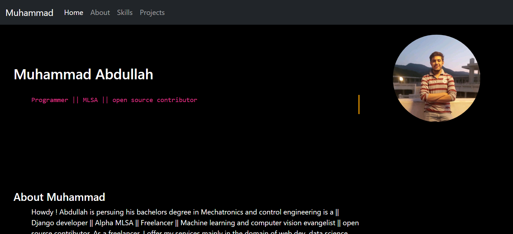

# Portfolio-React-App
It is My portdolio web app made using react.js as front end and django , django-rest framework as backend. 

## Working
The React front end placed in "front" directory of project communicate with "API" based django-restframework backend placed in "api" directory.
The front end fetches data, state is updated and component is rendered. I have used class based component for this project;

## Installation

Use the package manager [pip](https://pip.pypa.io/en/stable/) to install following packages.
Django :- 
```bash
pip install django
```
django_rest_framework
```bash
pip install djangorestframework
```
## Usage
You need to install bunch of stuff from npm to setup a REACT app. For that i have uploaded a zip file with 
all packages and dependencies. Download it and there will be a folder named "portfolio". Follow following steps to
get project running :)

Open CMD in the main directory ie "portfolio"
Type following command in command prompt
```python
python manage.py runserver
```
Now open another cmd in "front" folder inside "Portfolio"
Type following command then
```React
npm run dev
```
It will give you a local url with which you can navigate to App
## Samples
  # Home section
  
  # Skills section
  
  # Footer section
  
  # Projects section
  


## Contributing
Pull requests are welcome. For major changes, please open an issue first to discuss what you would like to change.

Please make sure to update tests as appropriate.
